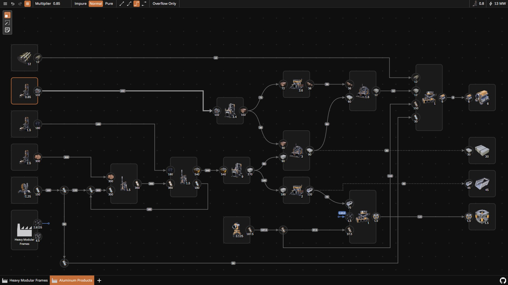

# Satisfactory Architect

A tool for planning, managing and visualizing Satisfactory factories.



## Building

You need to install [Node.js](https://nodejs.org) first.

#### Install dependencies (one time only)

```bash
npm install
```

#### Live server

```bash
npm run dev
```

#### Generate HTML files

```bash
npm run build
```

## Extracting data from game files

This is only a rough description. The process isn't fully automated, needs some manual work, and might be incomplete.

### Extract game files

First, extract game files using FModel. Some help is [here](https://docs.ficsit.app/satisfactory-modding/latest/Development/ExtractGameFiles.html).

Open `FactoryGame-Windows.utoc` and on the FactoryGame folder right click and press "Save Folder's Packages Textures". This will take some time. Then repeat with the .json option. This will again take some time.

Open `FactoryGame-Windows.pak`. From `FactoryGame\Content\Localization\AllStringTables\en-US` save `AllStringTables.json`.

### Optional: Update categories list

```bash
npx tsx scripts\GameJsonDumpProcessor.ts --extracted-files="path\to\extracted\files\FactoryGame\Content" --ts-save="path\to\this\repo\scripts\categories.ts"
```

### Update database and icons

```bash
npx tsx scripts\DocsJsonProcessor.ts --json="C:\Program Files (x86)\Steam\steamapps\common\Satisfactory\CommunityResources\Docs\en-US.json" --extracted-files="path\to\extracted\files\FactoryGame\Content\FactoryGame" --img-save="path\where\to\save\raw\images" --ts-save="path\to\this\repo\src\lib\satisfactoryDatabase.ts"
```

For the following steps I use [XnConvert](https://www.xnview.com/en/xnconvert).

Convert and save extracted images to `static\img\FactoryGame` as `[name]_[height].webp`.

In a separate folder, convert, downscale to 48px, and save extracted images as `[name]_48.webp`.

Update in-memory image previews:

```bash
npx tsx scripts\ImagePreprocessor.ts --folder="path\to\48x48\images" --save="path\to\this\repo\src\lib\iconPreviews.ts"
```
